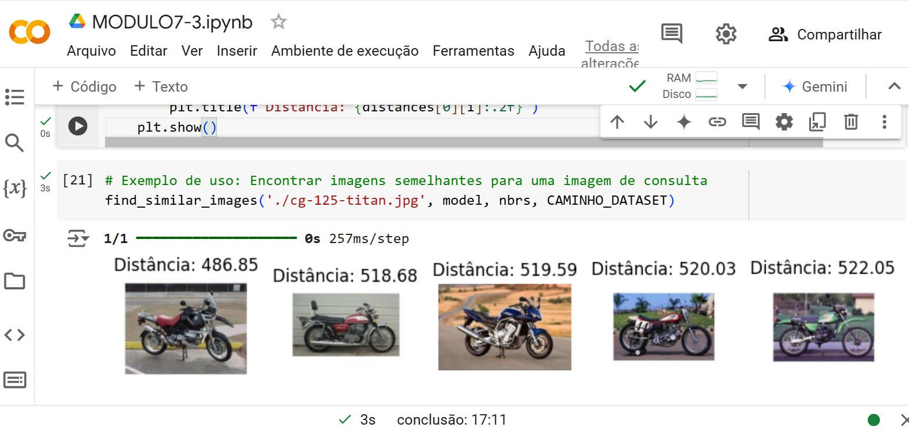

# Criando um Sistema de Recomendação por Imagens Digitais

No desafio do sétimo módulo do Bootcamp BairesDev - Machine Learning Practitioner promovido pela DIO chamado "Criando um Sistema de Recomendação por Imagens Digitais" foi criado um modelo capaz de classificar imagens por sua similaridade e gerar resultados para o usuário. O código foi feito em Python no ambiente COLAB e o arquivo criado se chama MODULO7_3.  

Bibliotecas utilizadas:

- Keras
- Numpy
- Matplotlib
- PIL

## Dataset

O dataset utilizado foi o **Caltech101**. Ele possui imagens divididas em 101 categorias, em média cada categoria tem 50 imagens no tamanho 300 x 200 pixels. O dataset foi copiado para o Google Drive. Ele pode ser encontrado no Kaggle, o link para download é este:

https://www.kaggle.com/datasets/imbikramsaha/caltech-101

Para fins de testes, o treinamento foi restrito a 3 categorias, motos, aviões e celulares.

## Modelo

O modelo utilizado no treinamento foi o ResNet50 e os pesos utilizados foram o do imagenet.

**ResNet50** (Residual Network com 50 camadas) é um modelo muito eficiente para aprendizado de características visuais, permitindo treinar redes muito profundas usando conexões residuais, que ajudam a evitar o problema de gradientes desaparecendo ou explodindo. Ela é uma rede neural convolucional pré-treinada amplamente utilizada para tarefas de classificação e aprendizado profundo.

**ImageNet** é um grande conjunto de dados com milhões de imagens rotuladas em milhares de categorias. Esses pesos permitem usar o modelo como ponto de partida para outras tarefas (transfer learning).
